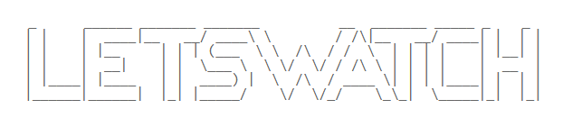
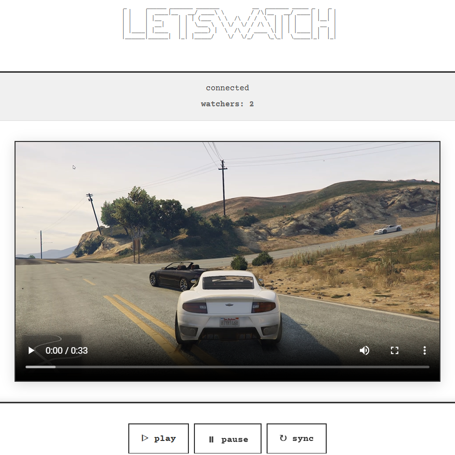
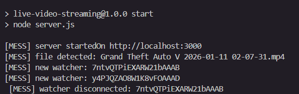

# 📺 LETSWATCH

<div align="center">



[](https://github.com/abbgoesghost/LETSWATCH/stargazers)
[](https://github.com/abbgoesghost/LETSWATCH/network)
[](https://github.com/abbgoesghost/LETSWATCH/issues)

**Watch videos in sync with your friends**

</div>

---

## What is it?

A personal project to watch videos together in real time... Open a room, share the link, and everyone stays in sync.

No account needed just a url and youre good to go.
---

## 🖥️ Screenshots

<div align="center">







</div>

---

## ✨ Features

- 🎬 **Real-time sync** play / pause / seek for everyone at the same time
- 🚪 **Rooms** create or join a room with a simple link
- ⚡ **Socket.IO** ultralow latency thanks to WebSockets
- 🧱 **Vanilla front** HTML / CSS / JS nothing heavy
---

## 🛠️ Stack

**Frontend**


**Backend**


**Tooling**


---

## 🚀 Getting started
### Prerequisites

- [Node.js](https://nodejs.org/)
- npm (with node bundel)

### Installation

```bash
# Clone this repo
git clone https://github.com/abbgoesghost/LETSWATCH.git
cd LETSWATCH

# Install dependencies
npm install
